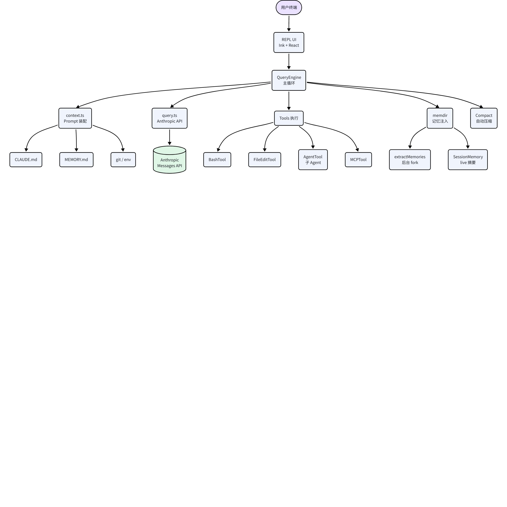
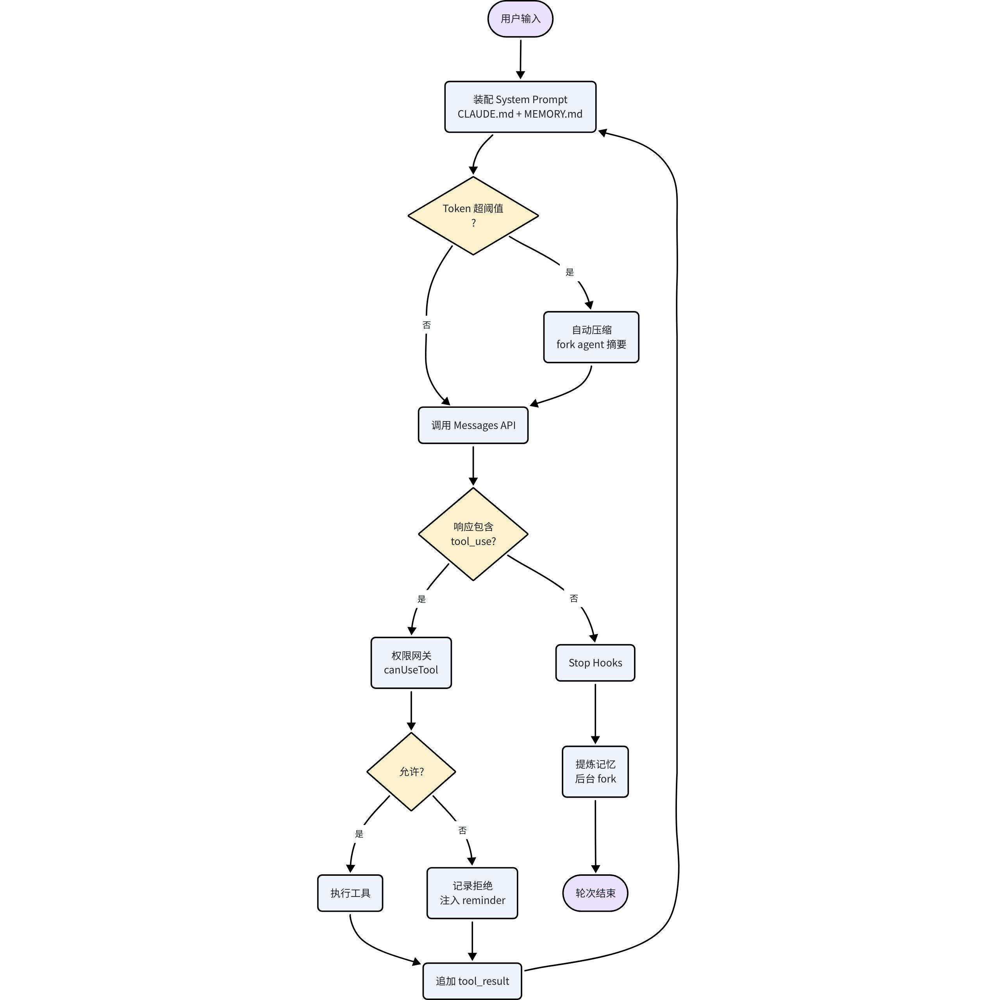
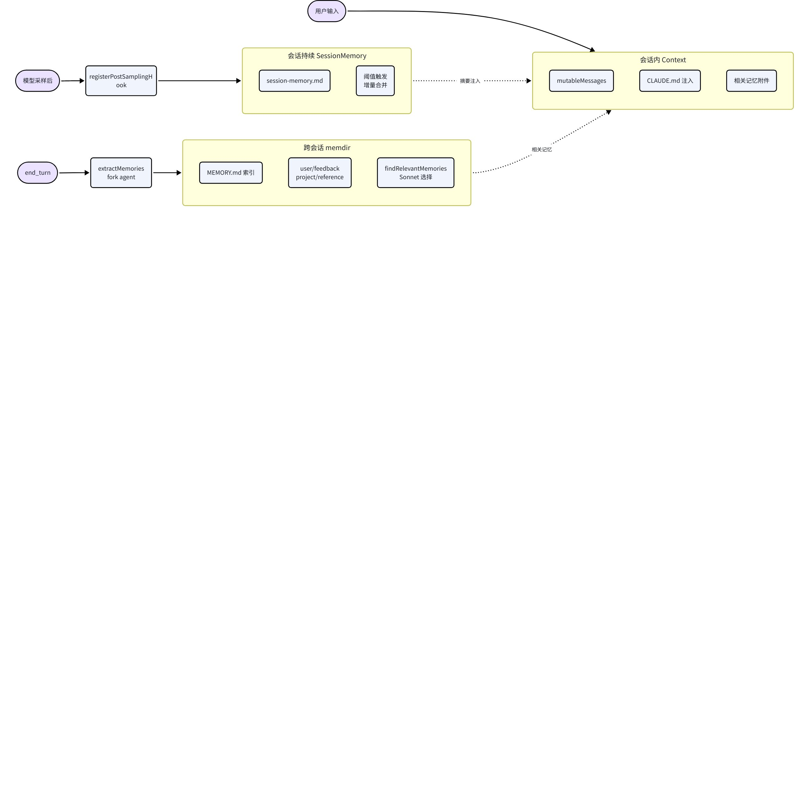

<callout emoji="blue_book" background-color="light-blue" border-color="light-blue">
**文档目标**：基于 `@anthropic-ai/claude-code@2.1.88` 解包源码，逐模块剖析其交互式 CLI Agent 的详细实现，重点覆盖 **上下文管理（Context）**、**记忆系统（Memory）**、**工具调用（Tool Calling）** 与 **用户交互（UX）** 四大核心子系统，可直接作为二次实现参考。
</callout>

# 1. 总览
## 1.1 代码结构
```plaintext
source/src/
├── entrypoints/        # CLI / SDK / MCP Server 入口
├── bootstrap/          # 启动时缓存、状态初始化
├── QueryEngine.ts      # 核心查询引擎（主循环）
├── query/              # 状态机配置、token 预算、stop 钩子
├── query.ts            # 对 Anthropic API 的单轮调用封装
├── context.ts          # 系统/用户上下文装配（CLAUDE.md、git、env）
├── Tool.ts             # 工具抽象基类与工厂
├── tools/              # 30+ 内置工具（Bash/FileEdit/Agent/Task...）
├── memdir/             # 自动记忆子系统（文件型长期记忆）
├── services/
│   ├── compact/        # 自动/手动压缩
│   ├── extractMemories/# 后台提炼记忆（分叉 agent）
│   ├── SessionMemory/  # 会话级持续记忆（live）
│   └── mcp/            # MCP 客户端
├── commands/           # 所有 slash 命令（/commit、/memory、/resume ...）
├── components/ + ink/  # React + Ink 终端 UI
├── screens/REPL.tsx    # 主 REPL
├── context/*.tsx       # React Context：模态、叠层、队列消息、通知
├── keybindings/, vim/  # 键位、Vim 模式
└── skills/             # 本地 Skill（自定义 Agent）

```

## 1.2 运行时拓扑
```plaintext
用户终端 ──stdin/Ink──▶ REPL (screens/REPL.tsx)
           ──▶ QueryEngine (状态机主循环)
                  ├── context.ts          → 组装 system / user prompt
                  ├── query.ts            → 调用 Anthropic /messages API
                  ├── tools/*             → 工具执行 + 权限网关
                  ├── memdir/*            → 注入 MEMORY.md 片段
                  ├── services/compact/*  → 自动压缩历史
                  └── services/extractMemories/* (后台 fork agent)

```

---

# 2. 上下文管理（Context Management）
## 2.1 QueryEngine：主循环与可变状态
**文件**：`source/src/QueryEngine.ts`（入口类，状态机循环于 line 184+）、`source/src/query.ts`（单轮 API 调用）、`source/src/query/config.ts / tokenBudget.ts / stopHooks.ts`。
`QueryEngine` 生命周期内持有一组不可变配置 + 一组随对话增长的可变状态：

<lark-table rows="11" cols="3" header-row="true" column-widths="180,160,390">

  <lark-tr>
    <lark-td>
      **字段**
    </lark-td>
    <lark-td>
      **类型/来源**
    </lark-td>
    <lark-td>
      **作用**
    </lark-td>
  </lark-tr>
  <lark-tr>
    <lark-td>
      `cwd`
    </lark-td>
    <lark-td>
      string
    </lark-td>
    <lark-td>
      启动目录，用于相对路径解析、CLAUDE.md 发现、git 状态读取
    </lark-td>
  </lark-tr>
  <lark-tr>
    <lark-td>
      `tools`
    </lark-td>
    <lark-td>
      `Tool[]`
    </lark-td>
    <lark-td>
      当前可用工具集（内置 + MCP + Skill）；随模式可裁剪（如 Plan 模式禁写工具）
    </lark-td>
  </lark-tr>
  <lark-tr>
    <lark-td>
      `mcpClients`
    </lark-td>
    <lark-td>
      `Map<name, Client>`
    </lark-td>
    <lark-td>
      激活的 MCP 客户端，在 `MCPTool` 内部分发调用
    </lark-td>
  </lark-tr>
  <lark-tr>
    <lark-td>
      `readFileCache`
    </lark-td>
    <lark-td>
      `FileStateCache`
    </lark-td>
    <lark-td>
      已读文件的 mtime + 内容哈希；`FileEditTool` 必须先 `Read` 才允许编辑（staleness 检测）
    </lark-td>
  </lark-tr>
  <lark-tr>
    <lark-td>
      `mutableMessages`
    </lark-td>
    <lark-td>
      `Message[]`
    </lark-td>
    <lark-td>
      对话消息数组，逐轮 `push`；UI 系统消息在发送前由 `normalizeMessagesForAPI()` 过滤
    </lark-td>
  </lark-tr>
  <lark-tr>
    <lark-td>
      `totalUsage`
    </lark-td>
    <lark-td>
      `NonNullableUsage`
    </lark-td>
    <lark-td>
      累加 input / output / cache_creation / cache_read 4 路 token
    </lark-td>
  </lark-tr>
  <lark-tr>
    <lark-td>
      `permissionDenials`
    </lark-td>
    <lark-td>
      list
    </lark-td>
    <lark-td>
      用户拒绝过的工具调用签名，提示模型不要重试相同调用
    </lark-td>
  </lark-tr>
  <lark-tr>
    <lark-td>
      `discoveredSkillNames`
    </lark-td>
    <lark-td>
      Set<string>
    </lark-td>
    <lark-td>
      本轮已出现的 Skill 名，用于惰性注入 Skill 正文
    </lark-td>
  </lark-tr>
  <lark-tr>
    <lark-td>
      `loadedNestedMemoryPaths`
    </lark-td>
    <lark-td>
      Set<string>
    </lark-td>
    <lark-td>
      已加载的嵌套 CLAUDE.md 路径去重
    </lark-td>
  </lark-tr>
  <lark-tr>
    <lark-td>
      `snipReplay`
    </lark-td>
    <lark-td>
      函数
    </lark-td>
    <lark-td>
      SDK 场景下的"历史截断回放"钩子：在 `HISTORY_SNIP` 特性启用时，把前面对话压成摘要再注入
    </lark-td>
  </lark-tr>
</lark-table>

**主循环伪代码**（基于 `QueryEngine.ts` + `query.ts`）：
```typescript
while (!done) {
  // 1. 组装 prompt
  const sys = await fetchSystemPromptParts({cwd, claudeMd, memory, env, gitStatus});
  const msgs = normalizeMessagesForAPI(mutableMessages);

  // 2. 预算检查：若超阈值则自动压缩
  if (shouldAutoCompact(totalUsage, model)) {
    await compactConversation(...);      // services/compact/compact.ts
  }

  // 3. 流式调用 API（带重试 + rate-limit 钩子）
  const reply = await sampleWithTools({system: sys, messages: msgs, tools, ...});
  mutableMessages.push(reply);

  // 4. 解析 tool_use block，并发或串行执行
  for (const tu of reply.toolUses) {
    const granted = await canUseTool(tu);          // 权限网关
    const out = await tool.call(tu.input, ctx);
    mutableMessages.push(toolResult(tu, out));
  }

  // 5. 没有 tool_use 即本轮结束；触发 stopHooks（含记忆提炼）
  if (reply.stopReason === 'end_turn') {
    await handleStopHooks(...);
    done = true;
  }

  // 6. Token 预算更新 + 连续对话退化检测
  budget.update(reply.usage);
  if (checkTokenBudget(budget) === 'STOP') break;
}

```

## 2.2 System Prompt 装配
**文件**：`source/src/context.ts`、`source/src/constants/prompts.ts`、`source/src/utils/queryContext.ts`。
- `getSystemPrompt()`（constants/prompts.ts）返回分行字符串数组，内容即 README/开发说明中看到的那段"You are Claude Code…" + 安全条款 + 执行动作的谨慎原则 + 语气与样式约定。
- `fetchSystemPromptParts()`（utils/queryContext.ts）把以下动态段注入占位符：
  - `{gitStatus}`：由 `git status` + 当前分支、最近 commit 组装（**注意**：快照只在会话启动取一次，不会自动刷新）。
  - `{claudeMd}`：经 `getMemoryFiles()` 发现并由 `utils/claudemd.ts` 过滤、截断后的项目/用户级 CLAUDE.md。
  - `{currentDate}`：当日日期，用于记录记忆时把相对时间改写成绝对日期。
  - `{env}`：OS、Shell、是否 git 仓、模型名等元信息。
- **缓存一致性**：`context.ts` 用 lodash `memoize` 缓存，命中同一会话；当 `BREAK_CACHE_COMMAND` 触发或认证信息变更时清空，并通过 `getSystemPromptInjection()`（line 25–34）插入一段随机串破坏 prompt cache。
- **getUserContext()**（line 116–189）：装配"用户上下文"块：`CLAUDE.md` 片段、`MEMORY.md` 片段、Skill 索引、当前 Git 状态、todo 列表等。该块以 `<system-reminder>` 包裹随 user 消息附带下发（可被压缩时丢弃）。
## 2.3 Token 预算与自动压缩
**文件**：`source/src/query/tokenBudget.ts`、`source/src/services/compact/autoCompact.ts`、`compact.ts`。
- `BudgetTracker`（line 6–20）四元组：`continuationCount`、`deltaTokens`、`globalTurnTokens`、最近一次 usage。
- `checkTokenBudget()`（line 45–93）：
  - 绝对阈值：`tokenCount >= 0.9 * contextWindow` → 立刻结束轮次。
  - 退化检测：同一轮连续 ≥3 次工具调用且每次 delta < 500 tokens → 判定模型进入"自循环"，强制停止。
- `getAutoCompactThreshold()`（autoCompact.ts）：`contextWindow - AUTOCOMPACT_BUFFER_TOKENS(13_000)`，即预留 13K 作输出/工具结果缓冲。
- 触发条件满足时调用 `compactConversation()`：
  1. 复制当前 system prompt + 全部消息；
  1. 附上一段专用 compact prompt，要求模型输出结构化摘要（保留决策、在跑任务、已验证结论）；
  1. 用**分叉 agent**执行（共享 prompt cache 以省钱）；
  1. 摘要作为单条 user message 放回主会话，后续消息全部丢弃，只保留摘要之后的。
- UI 层：顶栏 `tokenCountWithEstimation()` 连续显示用量；到达 20K 以下 warning、error 阈值会染色提醒（`calculateTokenWarningState()`）。
## 2.4 会话持久化、Resume 与 Rewind
**文件**：`source/src/assistant/sessionHistory.ts`、`source/src/history.ts`、`commands/resume`、`commands/rewind`、`commands/compact`。
- **本地 transcript**：每轮消息以 NDJSON 追加到 `~/.claude/sessions/{sessionId}/transcript.ndjson`（`history.ts:recordTranscript()`），包含 role、content、usage、uuid、父 uuid。
- **远程事件流**：若已登录 Claude.ai，`sessionHistory.ts` 通过 OAuth 从 `/v1/sessions/{sessionId}/events` 拉取事件（分页 `HISTORY_PAGE_SIZE=100`，游标 `anchor_to_latest / before_id`），供跨设备 resume 与事件回放。
- `/resume`：`launchResumeChooser()` 列出最近会话，选定后将 NDJSON 回放为 `mutableMessages`，并重新计算 totalUsage。
- `/rewind`：按 uuid 回到历史某点，后续消息作为"墓碑"（Tombstone 类型）保留展示但不进 API。
- `/compact`：手动触发与 auto-compact 同一路径；支持 `--instructions` 自定义摘要侧重。
## 2.5 CLAUDE.md 加载链
`context.ts:getMemoryFiles()` → `utils/claudemd.ts`：
1. 向上递归到 git 根，收集路径 `./CLAUDE.md`、`./CLAUDE.local.md`、以及 `~/.claude/CLAUDE.md`。
1. 支持 `@path/to/file` 内联引用（受 include 深度上限约束）。
1. 文件合并后缓存至 `bootstrap/state.js:setCachedClaudeMdContent()`，整个进程生命周期复用。
1. 内部支持嵌套加载：工具读到新目录的 `CLAUDE.md` 时，会把路径推入 `loadedNestedMemoryPaths`，之后 user 消息附带 reminder 注入其内容。
---

# 3. 记忆系统（Memory）
Claude Code 的记忆分三层：**会话内（mutableMessages / CLAUDE.md 注入）**、**自动记忆 memdir（文件型，跨会话）**、**会话持续记忆 SessionMemory（live session-memory.md）**。
## 3.1 memdir 自动记忆
**文件**：`source/src/memdir/{paths,memdir,memoryScan,memoryTypes,findRelevantMemories}.ts`。
### 3.1.1 存储路径解析
`memdir/paths.ts:getAutoMemBase()` 按优先级解析：
1. 环境变量 `CLAUDE_CODE_REMOTE_MEMORY_DIR`（CCR 覆盖，用于远程执行）。
1. `settings.json` 中的 `autoMemoryDirectory`，**仅**来自可信来源：policy / local / user settings —— `projectSettings` 被排除以防项目内恶意覆盖。
1. 默认：`~/.claude/projects/{sanitized-git-root}/memory/`，其中 `sanitized-git-root` 将路径中的 `/` 替换为 `-`。
`sanitizePath()` 防目录穿越；`isAutoMemPath(absolutePath)`（line 274）白名单校验所有读写入口。
### 3.1.2 入口 MEMORY.md 与类型
- 入口：`getAutoMemEntrypoint()` → `memory/MEMORY.md`（line 257–259）。
- 截断：`truncateEntrypointContent()`（line 57–102）—— **200 行 OR 25KB** 任一触顶即截断，并在尾部追加警告。避免 MEMORY.md 吃爆 system prompt。
- 日志位置：`getAutoMemDailyLogPath()` → `memory/logs/YYYY/MM/YYYY-MM-DD.md`。
每条具名记忆是独立 `.md` 文件，frontmatter 必填：
```markdown
---
name: {{memory name}}
description: {{one-line, 用于后续筛选命中相关性}}
type: {{user | feedback | project | reference}}
---

{{正文}}

```

- 类型定义：`memdir/memoryTypes.ts:MEMORY_TYPES`（line 14–19）。
- 解析：`parseMemoryType()`（line 28–30），非法/缺失即返回 `undefined`（优雅降级，不崩）。
- 两种拼装模式：`TYPES_SECTION_COMBINED` 合并所有类型并带 `<scope>` 标签；`TYPES_SECTION_INDIVIDUAL` 逐类型列出不带 scope。由 system prompt 构造时选择。
<callout emoji="bulb" background-color="light-blue">
类型语义对应 CLAUDE.md 的 "auto memory" 小节：
**user**：用户画像（角色、偏好、技能栈）；
**feedback**：校正指令，必须记录 Why + How to apply；
**project**：项目动态（截止日期、谁在做什么，必须写绝对日期）；
**reference**：外部系统指针（Linear 项目、Grafana dashboard URL）。
</callout>

### 3.1.3 加载与相关性检索
- `memdir/memdir.ts:loadMemoryPrompt()`：读 MEMORY.md → 截断 → 拼成 system prompt 片段。若目录不存在则注入 `DIR_EXISTS_GUIDANCE`（line 116）告诉模型路径可写。
- `ensureMemoryDirExists()`（line 129）：幂等 mkdir。
- `memdir/memoryScan.ts:scanMemoryFiles()`：遍历 memdir，抽取每个记忆文件的 frontmatter（filename / description / mtime），形成"记忆清单（manifest）"。
- `memdir/findRelevantMemories.ts:findRelevantMemories()`（line 39–75）：
  1. 拿 manifest + 当前用户输入喂给 **Sonnet**（独立请求）；
  1. 要求模型挑出 ≤5 个最相关的文件名；
  1. 过滤已经当前轮注入过的，避免重复；
  1. 命中文件以 `<attachment>` 形式随下一条 user message 下发。
- 遥测：`logMemoryDirCounts()`（line 153–185）异步记录文件数 / 子目录数，帮助诊断记忆膨胀。
### 3.1.4 后台记忆提炼
**文件**：`source/src/services/extractMemories/extractMemories.ts`。
- 触发点：`query/stopHooks.ts:handleStopHooks()`，仅在本轮 `stop_reason=end_turn`（无 tool_use）时执行。
- 实现：`runForkedAgent()` —— fork 当前主 agent，**共享 prompt cache**（TTL 5 分钟），避免冷启动成本。
- 游标机制：记录上次提炼 UUID。`countModelVisibleMessagesSince()`（line 82–109）统计新增消息数，`hasMemoryWritesSince()`（line 121–148）检测主 agent 在这段内是否已自行写 memory —— 若有则跳过，避免重复。
- 门控：
  - `isAutoMemoryEnabled()`（paths.ts line 30–55）：环境变量 > `--bare` 关闭 > CCR 持久化 > `settings.autoMemoryEnabled`。
  - `EXTRACT_MEMORIES` feature flag + `tengu_passport_quail` Statsig gate + `INTERACTIVE_SESSIONS` gate —— 仅交互式 REPL 中运行，`-p` 一次性模式跳过。
## 3.2 SessionMemory（实时会话摘要）
**文件**：`source/src/services/SessionMemory/sessionMemory.ts`。
- 目标：在长会话中持续维护 `.claude/sessions/{sessionId}/session-memory.md`，作为"摘要化的可注入上下文"，与 memdir 的跨会话长期记忆互补。
- 门控：`isSessionMemoryGateEnabled()` 检查 `tengu_session_memory`；配置缓存 `getSessionMemoryRemoteConfig()` 从 `tengu_sm_config` 动态配置拉取。
- 状态机字段：`lastMemoryMessageUuid`（游标）、`hasMetInitializationThreshold()`（第一次达到多少消息/tokens）、`hasMetUpdateThreshold()`（增量达标）。
- 注册方式：`registerPostSamplingHook()` —— 在模型每次输出后检查阈值，达标则后台启动 fork agent。
- 模板：`loadSessionMemoryTemplate()` 提供结构化 Markdown（目标、决策、未决、TODO 等）；`buildSessionMemoryUpdatePrompt()` 指示 fork agent 增量 merge 而非覆盖。
- 指标：`recordExtractionTokenCount()`、`markExtractionStarted/Completed()` 提供观测。
## 3.3 `/memory` 命令
`commands/memory` 提供交互入口：
- 列出当前 memdir 文件与元数据；
- 打开 MEMORY.md 编辑；
- 强制触发一次提炼（绕过阈值门控）；
- 清理某条记忆或某类型全部记忆。
## 3.4 团队记忆同步
`services/teamMemorySync` + `memdir/teamMemPaths.ts / teamMemPrompts.ts`：企业版按团队同步共享 memdir 子目录；写入走同一 `isAutoMemPath` 白名单。
---

# 4. 工具调用（Tool Calling）
## 4.1 Tool 抽象与注册
**文件**：`source/src/Tool.ts`、`source/src/tools.ts`、`source/src/tools/*`。
### 4.1.1 `ToolUseContext`（Tool.ts line 158–250+）
每次调用工具都传入一份上下文：

<lark-table rows="6" cols="2" header-row="true" column-widths="180,390">

  <lark-tr>
    <lark-td>
      **字段**
    </lark-td>
    <lark-td>
      **说明**
    </lark-td>
  </lark-tr>
  <lark-tr>
    <lark-td>
      `tools, commands, mcpClients`
    </lark-td>
    <lark-td>
      可见工具/命令表；Agent / TaskCreate 这类"回调型"工具据此递归
    </lark-td>
  </lark-tr>
  <lark-tr>
    <lark-td>
      `canUseTool` (`CanUseToolFn`)
    </lark-td>
    <lark-td>
      权限网关闭包，最终落到 UI 弹框或策略引擎
    </lark-td>
  </lark-tr>
  <lark-tr>
    <lark-td>
      `readFileState`
    </lark-td>
    <lark-td>
      共享的 FileStateCache，保证"读后编辑"链路 staleness 校验
    </lark-td>
  </lark-tr>
  <lark-tr>
    <lark-td>
      `AppState`
    </lark-td>
    <lark-td>
      Ink App 状态指针：当前模型、Plan 模式、Worktree 等模态切换
    </lark-td>
  </lark-tr>
  <lark-tr>
    <lark-td>
      `abortController`
    </lark-td>
    <lark-td>
      Esc 中断时广播到正在执行的工具（如长跑 Bash）
    </lark-td>
  </lark-tr>
</lark-table>

### 4.1.2 `buildTool(...)` 工厂
工厂字段定义了工具的完整契约：

<lark-table rows="9" cols="3" header-row="true" column-widths="180,120,330">

  <lark-tr>
    <lark-td>
      **字段**
    </lark-td>
    <lark-td>
      **类型**
    </lark-td>
    <lark-td>
      **用途**
    </lark-td>
  </lark-tr>
  <lark-tr>
    <lark-td>
      `name`
    </lark-td>
    <lark-td>
      string
    </lark-td>
    <lark-td>
      工具名，进入 API `tools` 清单
    </lark-td>
  </lark-tr>
  <lark-tr>
    <lark-td>
      `description` / `prompt()`
    </lark-td>
    <lark-td>
      string / async
    </lark-td>
    <lark-td>
      静态描述 + 动态 prompt（BashTool 会把超时/安全守则动态拼入）
    </lark-td>
  </lark-tr>
  <lark-tr>
    <lark-td>
      `inputSchema` / `outputSchema`
    </lark-td>
    <lark-td>
      Zod
    </lark-td>
    <lark-td>
      入参/出参校验
    </lark-td>
  </lark-tr>
  <lark-tr>
    <lark-td>
      `call(input, ctx)`
    </lark-td>
    <lark-td>
      async generator
    </lark-td>
    <lark-td>
      可多次 yield 进度（展示 spinner），最后 yield result
    </lark-td>
  </lark-tr>
  <lark-tr>
    <lark-td>
      `shouldDefer`
    </lark-td>
    <lark-td>
      bool
    </lark-td>
    <lark-td>
      **延迟加载工具**：schema 不一次性塞进 system prompt，等模型通过 ToolSearch 明确索取再加载（解决工具数爆炸时的 prompt 膨胀）
    </lark-td>
  </lark-tr>
  <lark-tr>
    <lark-td>
      `isEnabled(ctx)`
    </lark-td>
    <lark-td>
      bool
    </lark-td>
    <lark-td>
      运行时开关（如 Plan 模式下禁写）
    </lark-td>
  </lark-tr>
  <lark-tr>
    <lark-td>
      `isConcurrencySafe`
    </lark-td>
    <lark-td>
      bool
    </lark-td>
    <lark-td>
      同一轮中是否可并发（Read/Glob 是；Edit/Write/Bash 不是）
    </lark-td>
  </lark-tr>
  <lark-tr>
    <lark-td>
      `renderToolUseMessage`
    </lark-td>
    <lark-td>
      ReactNode
    </lark-td>
    <lark-td>
      UI 自定义渲染（如 Edit 显示 diff）
    </lark-td>
  </lark-tr>
</lark-table>

### 4.1.3 注册与筛选
- `tools.ts` 中心化 import 全部内置工具 + 收集 MCP / Skill 工具 → `getTools()` 返回上下文过滤后的集合。
- 过滤顺序：`isEnabled()` → 模式裁剪（plan 模式）→ 权限预检 → `shouldDefer`（延迟工具只在 prompt 中列名与描述，不带 schema，需通过 `ToolSearchTool` 获取完整 schema）。
## 4.2 延迟工具（Deferred Tools）与 ToolSearch
模型面对数百工具时上下文爆炸。Claude Code 的解法：
1. 启动时 system prompt 只列 deferred 工具的 **name 与一句话 description**。
1. 模型决定调用前先用 `ToolSearchTool` 查询 → `{"query": "select:BashTool,Grep"}` 直接精选，或 `{"query": "nested notebook"}` 做关键词匹配。
1. 返回的 `<functions>{…}</functions>` 块格式与 system prompt 顶部工具清单同构，模型即可照调。
本地 Skill、MCP Server 注册的自定义工具、TaskCreate 等默认走 deferred 路径；核心工具 Read/Grep/Glob/Edit/Bash 直接驻留。
## 4.3 代表工具实现
### 4.3.1 BashTool
- `tools/BashTool/prompt.ts`：动态 prompt，注入 `getDefaultTimeoutMs()` / `getMaxTimeoutMs()`、后台任务指引、commit/PR 指令（内置 undercover 防注入守则）。
- 命令语义：`readOnlyValidation.ts` 判别是否只读、是否销毁性；Sandbox 默认仅允许只读命令无提示。
- 执行：`SandboxManager`（`utils/sandbox/sandbox-adapter.ts`）统一封装 bubblewrap (Linux) / sandbox-exec (macOS) / user-mode。
- 输出：以 `LOCAL_COMMAND_STDOUT_TAG` / `LOCAL_COMMAND_STDERR_TAG` XML 标签包裹，便于模型分辨。
- 后台：`run_in_background=true` 写 `/tmp/claude-{session}/tasks/{id}.output`，主流程立即返回 `task_id`。
### 4.3.2 FileEditTool
- 严格 `Read-before-Edit`：利用 `readFileState` 校验 mtime/hash，文件被外部修改则强制先重新 Read。
- 动作：`str_replace`（要求 `old_string` 唯一，提供 `replace_all` 放宽）、`create`。
- `getPatchForEdit()` 生成 unified diff 记入遥测、用于 UI 显示。
- IDE 联动：`notifyVscodeFileUpdated()` + `clearDeliveredDiagnosticsForFile()` 清除已投递的 LSP 诊断。
- 权限：`checkWritePermissionForTool()` + `matchingRuleForInput()` 按 glob 规则决定是否需人工确认。
### 4.3.3 AgentTool / TaskCreateTool（Sub-agent 体系）
- `tools/AgentTool/runAgent.ts:runAgent()`：基于 `runForkedAgent()` —— 复制父 system prompt/工具/消息历史形成独立 QueryEngine。
- 子 agent 类型：`generalPurposeAgent`（默认）、`planAgent`、`exploreAgent`、`claudeCodeGuideAgent` + 用户自定义（由 `loadAgentsDir.ts:getAgentDefinitionsWithOverrides()` 扫描 `.claude/agents/` 加载）。
- `agentMemorySnapshot.ts`：fork 前快照消息，防止父 agent 后续修改影响子 agent。
- `agentColorManager.ts`：给每个并发子 agent 分配独立 ANSI 色，便于终端区分。
- `TaskCreateTool` 与 AgentTool 的区别：TaskCreate 是**长跑 deferred 任务**（`shouldDefer:true`），结果通过 `/tasks` 命令或 `TaskOutput/TaskGet` 异步查询；AgentTool 返回 single-shot 结果。
- 结果注入：子 agent 只把最终摘要字符串作为 tool_result 回父 agent —— 父 agent 看不到子 agent 完整对话，天然节约上下文。
### 4.3.4 MCPTool
- `tools/MCPTool/MCPTool.ts`：通用桥接，动态注册 MCP Server 暴露的 Tool / Resource。
- Transport：`services/mcp/types.ts:TransportSchema` 支持 stdio / sse / http / ws / sdk。
- OAuth：`services/mcp/auth.ts` 处理 token 交换；`elicitationHandler.ts` 响应 `-32042` 错误（服务端请求用户进行 URL 交互）。
- `classifyForCollapse.ts`：判定工具调用是否可在 compact 摘要时折叠隐藏（减少摘要 token）。
## 4.4 权限网关与 Hooks
- 模式枚举：`default`、`auto`、`bypass`、`sandbox`。
- `CanUseToolFn`：顺序 → 预设规则（allowRules / denyRules） → 钩子（costHook、autoMode） → UI 弹框（dialogLaunchers.tsx 模态）。
- Hook 定义在 `settings.json` 的 `hooks` 字段：每个事件（`PreToolUse`、`PostToolUse`、`UserPromptSubmit`、`Stop`、`SubagentStop`、`Notification` 等）可配置 shell 命令；hook stdout 可附加注入 `<user-prompt-submit-hook>` 内容作为额外 context。
- 被拒绝时：`permissionDenials` 追加签名并以 `<system-reminder>` 下发给模型（"用户拒绝了 X，不要重复尝试"）。
## 4.5 工具结果标准化
- `ToolResultBlockParam = { tool_use_id, content, is_error }`，`content` 可为纯文本或混合内容块（图像/文件）。
- `SyntheticOutputTool` / `SYNTHETIC_OUTPUT_TOOL_NAME`：构造合成 tool_result，用于把"系统级事件"伪装成工具输出回注（如 hook 的反馈、被压缩消息的摘要片段）。
- `toolUseSummary` 服务：长输出工具（如 1000+ 行 Read）走摘要裁剪，UI 展示全文，API 上下文注入精简版。
---

# 5. 用户交互与实现方案
## 5.1 三种运行形态

<lark-table rows="4" cols="3" header-row="true" column-widths="180,260,290">

  <lark-tr>
    <lark-td>
      **形态**
    </lark-td>
    <lark-td>
      **入口**
    </lark-td>
    <lark-td>
      **特点**
    </lark-td>
  </lark-tr>
  <lark-tr>
    <lark-td>
      交互式 REPL
    </lark-td>
    <lark-td>
      `entrypoints/cli.tsx` → `main.tsx` → `replLauncher.tsx:launchRepl()` → `screens/REPL.tsx`
    </lark-td>
    <lark-td>
      Ink 渲染；支持 slash 命令、权限弹框、Vim、流式 token 展示
    </lark-td>
  </lark-tr>
  <lark-tr>
    <lark-td>
      Non-interactive `-p`
    </lark-td>
    <lark-td>
      `utils/processUserInput/processUserInput.ts`
    </lark-td>
    <lark-td>
      stdin → 一次性响应；不渲染 UI；可接 shell pipeline
    </lark-td>
  </lark-tr>
  <lark-tr>
    <lark-td>
      SDK / Agent SDK
    </lark-td>
    <lark-td>
      `entrypoints/agentSdk.ts` + `entrypoints/sdk/`
    </lark-td>
    <lark-td>
      StructuredIO 协议（JSON RPC-like），工具调用/结果通过 NDJSON 交换，供嵌入式集成
    </lark-td>
  </lark-tr>
</lark-table>

此外还有 `entrypoints/mcp.ts`（把 Claude Code 本身作为 MCP Server 对外暴露）。
## 5.2 启动引导（bootstrap）
`main.tsx`（line 33+）流程：
1. 解析 CLI 参数（commander）：`-p`, `--model`, `--bare`, `--add-dir`, `--permission-mode`, `--resume`, slash-command 透传等。
1. `seedEarlyInput()`：在 Ink 挂载前抢先吸收 stdin（处理外部 pipeline 即时输入），`stopCapturingEarlyInput()` 在 UI 就绪后归还。
1. `bootstrap/state.js` 预热缓存（CLAUDE.md、settings、feature gates）。
1. `projectOnboardingState.ts:getSteps()`：若首次进入仓库，提示 `/init` 生成 CLAUDE.md。
1. 初始化 MCP 客户端、permission engine、analytics。
1. 挂 React 树：`<App>` → `<FullscreenLayout>` → `<REPL>`。
## 5.3 REPL 组件树与 Context
**文件**：`source/src/screens/REPL.tsx`、`source/src/components/*`、`source/src/context/*.tsx`、`source/src/ink/*`。
- `ink.tsx`：Ink 的 fork，负责把 React 树渲染为 ANSI buffer、处理 keypress、帧率（`context/fpsMetrics.tsx`）。
- `components/App.tsx`：挂载所有 Provider（theme / stats / terminal size / mailbox / queued messages / modal / overlay / notifications / voice）。
- `screens/REPL.tsx`：上下两栏——上方 transcript（逐消息渲染），下方输入框 + 状态栏；底部预留"模态槽位"。
- Context 分工：
  - `modalContext.tsx`：阻塞型模态（权限确认、resume 选择、message selector），`useModalOrTerminalSize()` 按可用行数动态调整。
  - `overlayContext.tsx`：非阻塞叠层（自动补全、斜杠命令 picker）。
  - `QueuedMessageContext.tsx`：用户在模型仍在响应时连续按 Enter，消息进入队列，按顺序注入。
  - `notifications.tsx`：toast 消息。
  - `mailbox.tsx`：子 agent / 远程 session 完成时回主 REPL 的信箱。
## 5.4 消息模型
`types/message.ts`：
```typescript
type Message =
  | UserMessage
  | AssistantMessage
  | AttachmentMessage      // 附件（Read 结果、memory、hook 注入）
  | SystemMessage          // LocalCommand 输出、指标、compact 边界
  | ProgressMessage        // 工具 yield 的进度
  | ToolUseSummaryMessage  // 工具结果的精简视图
  | TombstoneMessage       // rewind 丢弃点

```

- **UserMessage**：`{type: 'user', content: [text|toolResult|image...], toolUseResult?, sourceToolAssistantUUID?}`，其中 `content` 是 Anthropic ContentBlock 数组。
- **AssistantMessage**：直接包装 SDK `BetaMessage`，加 `interrupted?` 标志。
- **AttachmentMessage**：把记忆文件、远程文件、hook 决策信息挂到下一条 user 消息后面发给模型。
- `normalizeMessagesForAPI()`：剥离 UI-only 消息（Progress / Tombstone / SystemMessage 的非关键类型），合并相邻 content，确保送进 API 的结构合法。
## 5.5 输入层与键位
- **输入组件**：自研行编辑器（光标、选中、粘贴桥），支持多行（Shift+Enter）、历史（↑/↓）、补全（Tab）。
- **Slash 命令**：输入以 `/` 开头触发 picker overlay，`commands.ts` 通过 feature-gate import，`utils/messageQueueManager.ts:isSlashCommand()` 解析，`getCommandsByMaxPriority()` 解决同名冲突（内置 < 插件 < 用户）。
- **键位**：`keybindings/` 读取 `~/.claude/keybindings.json`；默认绑定 Esc（中断）、Ctrl+C（清输入/退出）、Ctrl+L（清屏）、Ctrl+R（resume）、`!` 前缀（直接执行 bash）、`#` 前缀（写 memory）。
- **Vim 模式**：`vim/{motions,operators,textObjects,transitions,types}.ts` 实现模态；由 `/vim on` 激活。
- **语音**：`voice/` + `services/voiceStreamSTT.ts` 可选麦克风输入。
## 5.6 权限与确认 UX
- 触发：工具 `canUseTool()` 判定需要用户决定时，`dialogLaunchers.tsx` 挂载模态。
- 模态内容：工具名、参数摘要（如要 Edit 的文件路径 + diff 预览）、"本次允许 / 一直允许 / 拒绝"三选项。
- 选"一直允许"将规则写回 `settings.local.json` 的 `permissions.allow` 列表；项目级（共享给团队）走 `settings.json`。
- Sandbox 模式下只读操作跳过所有确认（最激进），`bypass` 模式跳过所有确认但仍记录。
- 被拒绝：UI 显示红色 tombstone，同时以 system-reminder 告知模型"不要重试"。
## 5.7 Slash 命令分类
`commands/` 目录大类：

<lark-table rows="8" cols="2" header-row="true" column-widths="180,470">

  <lark-tr>
    <lark-td>
      **类别**
    </lark-td>
    <lark-td>
      **典型命令**
    </lark-td>
  </lark-tr>
  <lark-tr>
    <lark-td>
      会话管理
    </lark-td>
    <lark-td>
      `/clear` `/compact` `/resume` `/rewind` `/export` `/session`
    </lark-td>
  </lark-tr>
  <lark-tr>
    <lark-td>
      记忆 / 配置
    </lark-td>
    <lark-td>
      `/memory` `/init` `/config` `/permissions` `/statusline` `/output-style` `/theme`
    </lark-td>
  </lark-tr>
  <lark-tr>
    <lark-td>
      模型 / 模式
    </lark-td>
    <lark-td>
      `/model` `/fast` `/effort` `/plan` `/thinkback` `/ultraplan`
    </lark-td>
  </lark-tr>
  <lark-tr>
    <lark-td>
      Git / PR
    </lark-td>
    <lark-td>
      `/commit` `/commit-push-pr` `/pr_comments` `/review` `/branch` `/security-review`
    </lark-td>
  </lark-tr>
  <lark-tr>
    <lark-td>
      MCP / 插件
    </lark-td>
    <lark-td>
      `/mcp` `/plugin` `/install-github-app` `/install-slack-app` `/skills`
    </lark-td>
  </lark-tr>
  <lark-tr>
    <lark-td>
      任务 / 远程
    </lark-td>
    <lark-td>
      `/tasks` `/remote-setup` `/teleport` `/schedule` `/mobile` `/share`
    </lark-td>
  </lark-tr>
  <lark-tr>
    <lark-td>
      诊断
    </lark-td>
    <lark-td>
      `/doctor` `/diff` `/cost` `/stats` `/insights` `/debug-tool-call` `/heapdump` `/release-notes`
    </lark-td>
  </lark-tr>
</lark-table>

## 5.8 状态栏 / 通知 / 流式渲染
- Status line：底部右侧显示模型名、已用 tokens（`tokenCountWithEstimation()` 实时估算）、上下文剩余百分比、连接状态、费用（`cost-tracker.ts:getTotalCost()`）。支持 `statusline` 自定义命令输出。
- 流式：`setStreamMode()` 控制 spinner；模型输出 content block 增量追加到 transcript，工具进度通过 `ProgressMessage` 即时渲染。
- Notifications：`Notification = {level, message}` 由 `addNotification()` 入队，toast 式显示在底部。
- 后台指示：记忆提炼、子 agent、远程 session 运行时均以灰色 footer line 提醒"in background"。
## 5.9 特殊交互流
- **Plan 模式**（`EnterPlanModeTool` / `ExitPlanModeV2Tool`）：禁用写工具，专注输出文档/方案；退出时强制用户确认计划后才允许执行。
- **Worktree 模式**（`EnterWorktreeTool` / `ExitWorktreeTool`）：在临时 git worktree 隔离改动，Agent 完成后若无变更自动清理，否则返回路径。
- **Resume 选择器**：`launchResumeChooser()` 列出最近 N 个会话（本地 + 远程），双栏预览（问题 + 最后 assistant 响应）。
- **Message Selector**（`components/MessageSelector.tsx`）：在手动 compact 前让用户勾选"必保留"的消息。
- **Rewind / 墓碑**：可视保留已丢弃消息，灰化显示便于回滚。
---

# 6. 可扩展性与关键设计决策
1. **分叉 Agent 复用 prompt cache**：记忆提炼、自动压缩、SessionMemory、子 agent 四条路径全部基于 fork + 共享 cache，大幅降低后台任务成本。
1. **Deferred Tools 解决工具爆炸**：只在模型真的要用时才下发 schema，配合 `ToolSearchTool` 做二次检索。
1. **文件型记忆而非向量库**：人类可读、可审计、可 git 管理；相关性选择靠 Sonnet 而非 embedding，规避 stale index 问题。
1. **Read-before-Edit + FileStateCache**：以强约束换来对并发外部修改的安全性。
1. **权限/信任分级**：记忆目录 / settings 读取区分 policy > local > user > project，杜绝项目级恶意覆盖。
1. **Hook 即扩展点**：`settings.json:hooks` 以 shell 命令形式接入 PreToolUse / PostToolUse / Stop 等事件，通过 stdout 回注上下文。
1. **可中断性**：每一个异步 await 都接 `abortController.signal`；Esc 一键杀子流程（Bash / 子 agent / LLM 流）。
1. **UI 与状态分离**：React Context 驱动模态/叠层/队列，模型层完全不感知 UI，REPL 只是一个状态消费者。
---

# 7. 端到端时序示例
一次用户输入 `修复 utils/foo.ts 的空指针` 的完整链路：
1. **输入阶段**（REPL）：按 Enter → `QueuedMessageContext` push → `QueryEngine` 消费。
1. **上下文组装**：`fetchSystemPromptParts()`（system prompt + CLAUDE.md + MEMORY.md 片段 + Skill index + env）。
1. **相关性记忆**：`findRelevantMemories()` 基于用户输入从 memdir 挑 5 条附到 user message。
1. **API 请求**：`query.ts` 调 `/v1/messages`（含 tools 清单，非 deferred 全带 schema）。
1. **模型响应**：流式返回 thinking + tool_use(Read `utils/foo.ts`)。
1. **工具执行**：`ReadTool` 查 `readFileState` → 实际 FS 读 → 写回缓存 → yield ToolResult。
1. **再请求**：新 messages 含 tool_result → 模型再出 tool_use(Edit)。
1. **权限网关**：`canUseTool(Edit)` → 规则未命中 → 弹模态 → 用户"本次允许"。
1. **Edit 执行**：校验 `readFileState` mtime 未变 → patch → 写入 → `notifyVscodeFileUpdated()`。
1. **模型收尾**：无新 tool_use，`stop_reason=end_turn`。
1. **Stop Hook**：`handleStopHooks()` 触发 extractMemories fork agent → 读最新对话 → 若有新的用户偏好/项目信息则写入 memdir。
1. **UI 更新**：transcript 渲染 diff + 成功提示；Status line 刷新 token 用量；SessionMemory 若达阈值也被后台调度更新。
---

<callout emoji="white_check_mark" background-color="light-green" border-color="light-green">
**结论**：Claude Code 的架构可概括为"React + Ink 驱动的可中断 Agent 状态机"。核心可复用范式为 —— (1) fork-agent + 共享 prompt cache 的后台子任务；(2) 文件型人类可读记忆 + LLM 自主选择；(3) Deferred Tools + ToolSearch 解决工具空间扩展性；(4) Read-before-Edit 的状态缓存保证并发安全；(5) 多级权限 + Hooks 的可扩展信任模型。
</callout>

---

# 附录：架构示意图
## A. 整体架构


<!-- whiteboard token: TZ4Dwn2RphKDTObV2YBcZGg3nMf -->

## B. QueryEngine 主循环


<!-- whiteboard token: EJQ9wEirfhqTOtbnWWZceYVSnCh -->

## C. 记忆系统三层


<!-- whiteboard token: FkzmwASvuhZAO9bnzWacer99n8b -->

